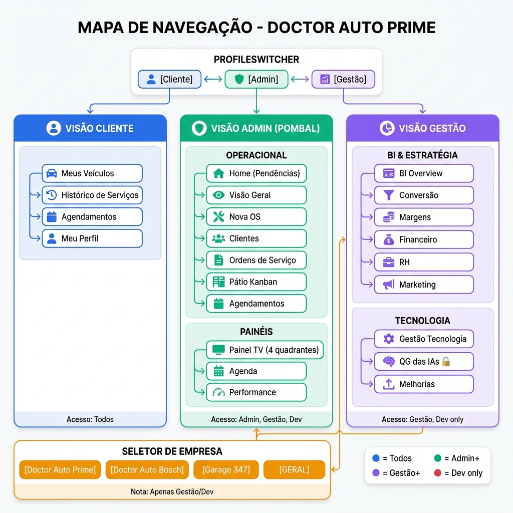
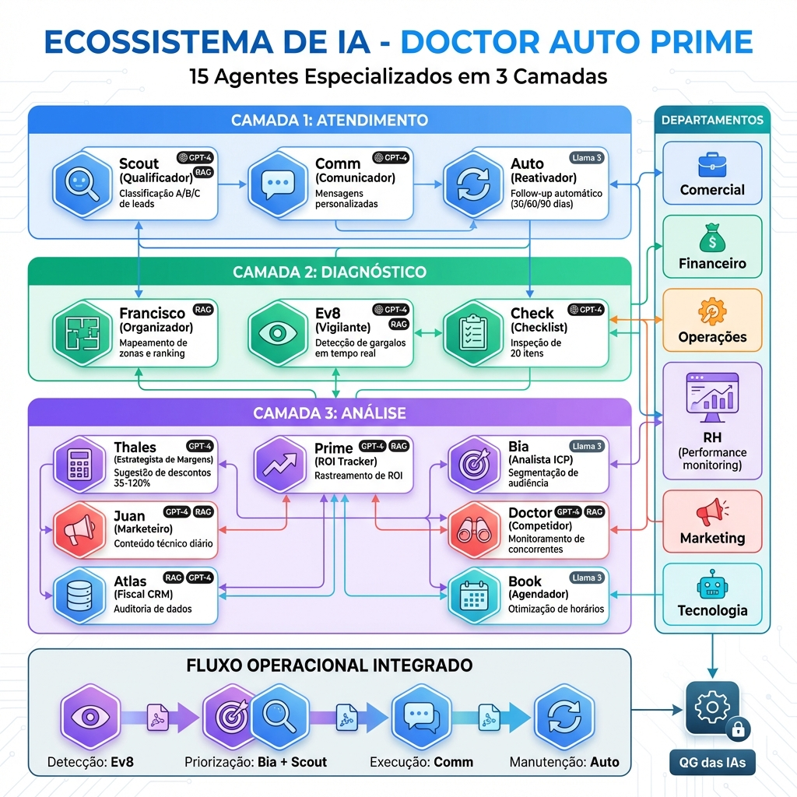
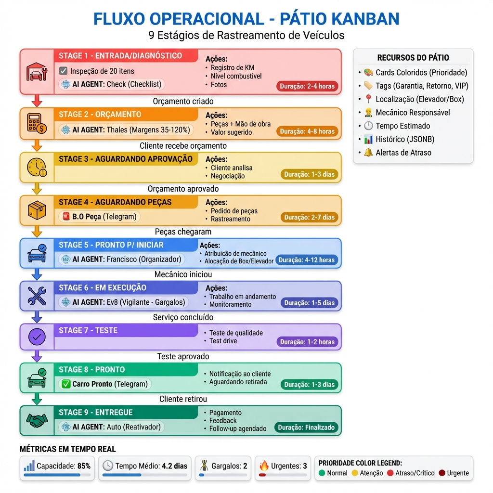

# 🗺️ MAPA COMPLETO DO SISTEMA DOCTOR AUTO PRIME

> **Versão Pública em Produção**: https://doctorautoprime.vercel.app  
> **Última Atualização**: 22 de Janeiro de 2026  
> **Status**: ✅ Sistema V1.1 - Totalmente Funcional

---

## 📋 ÍNDICE

1. [Visão Geral do Sistema](#visão-geral-do-sistema)
2. [Arquitetura Técnica](#arquitetura-técnica)
3. [Estrutura Organizacional](#estrutura-organizacional)
4. [Mapa de Navegação](#mapa-de-navegação)
5. [Sistema de Permissões (RBAC)](#sistema-de-permissões-rbac)
6. [Banco de Dados](#banco-de-dados)
7. [Ecossistema de IAs](#ecossistema-de-ias)
8. [Integrações Externas](#integrações-externas)
9. [Fluxo Operacional](#fluxo-operacional)

---

## 🖼️ DIAGRAMAS VISUAIS

### Galeria de Mapas do Sistema

Todos os diagramas estão disponíveis em alta resolução na pasta `docs/mapas/`:

#### 1. Arquitetura do Sistema

**Visão geral da arquitetura em 3 camadas**: Frontend (React 19), Backend (Supabase), e Integrações (Kommo, Telegram, AI APIs). Inclui o Pátio Kanban de 9 estágios, os 6 departamentos, e o sistema de IA em 3 camadas.

---

#### 2. Mapa de Navegação

**Estrutura completa de navegação**: ProfileSwitcher com 3 visões (Cliente, Admin, Gestão), módulos operacionais (POMBAL), módulos estratégicos (BI), e seletor multi-empresa.

---

#### 3. Schema do Banco de Dados

**Diagrama ERD completo**: Todas as tabelas organizadas por área funcional (Usuários, Multi-Tenancy, Operacional, IA, Financeiro, Integrações) com relacionamentos e chaves estrangeiras.

---

#### 4. Ecossistema de IA

**15 Agentes de IA em 3 Camadas**: Atendimento (Scout, Comm, Auto), Diagnóstico (Francisco, Ev8, Check), e Análise (Thales, Prime, Bia, Juan, Doctor, Atlas, Book). Inclui mapeamento para os 6 departamentos.

---

#### 5. Fluxo do Pátio Kanban

**Workflow completo de 9 estágios**: Desde Entrada/Diagnóstico até Entregue, com durações estimadas, agentes de IA envolvidos, e recursos do pátio (tags, localização, alertas).

---

#### 6. Matriz de Permissões RBAC

**Sistema de 9 níveis de acesso**: Matriz completa mostrando permissões de cada papel (Master, Dev, Gestão, Admin, Vendedor, Atendente, Mecânico, Cliente) para todos os módulos do sistema.

---

## 🎯 VISÃO GERAL DO SISTEMA

### O que é o Doctor Auto Prime?

**Doctor Auto Prime** é um CRM/ERP completo e multi-empresa desenvolvido especificamente para oficinas mecânicas premium. O sistema gerencia todo o ciclo de atendimento ao cliente, desde a captação de leads até a entrega do veículo, incluindo:

- ✅ Gestão de Clientes e Veículos
- ✅ Agendamentos e Ordens de Serviço
- ✅ Pátio Kanban (9 estágios de workflow)
- ✅ Business Intelligence (BI) e Dashboards Estratégicos
- ✅ Sistema de IA em 3 Camadas
- ✅ Integração com Kommo CRM
- ✅ Multi-Tenancy (3 empresas em 1 sistema)

### Empresas Suportadas

O sistema opera em modo **multi-empresa**, suportando 3 unidades distintas:

1. **Doctor Auto Prime** (Unidade Principal)
2. **Doctor Auto Bosch** (Unidade Certificada Bosch)
3. **Garage 347** (Unidade Boutique)

Cada empresa possui:
- Dados isolados (clientes, veículos, OS)
- Identidade visual própria (cores, logo)
- Equipe dedicada
- Visão consolidada "GERAL" para gestão estratégica

---

## 🏗️ ARQUITETURA TÉCNICA

### Stack Tecnológico

```
┌─────────────────────────────────────────────────────┐
│                    FRONTEND                          │
│  React 19 + TypeScript + Vite (Rolldown)            │
│  TailwindCSS + Shadcn/UI + Lucide Icons             │
└─────────────────────────────────────────────────────┘
                        ↕
┌─────────────────────────────────────────────────────┐
│                    BACKEND                           │
│  Supabase (PostgreSQL + Auth + Edge Functions)      │
│  Row Level Security (RLS) + Multi-Tenancy            │
└─────────────────────────────────────────────────────┘
                        ↕
┌─────────────────────────────────────────────────────┐
│                  INTEGRAÇÕES                         │
│  Kommo CRM (OAuth2) + Telegram Bot + AI APIs        │
└─────────────────────────────────────────────────────┘
```

### Ambiente de Produção

- **Hosting**: Vercel (Frontend) + Supabase Cloud (Backend)
- **URL Pública**: https://doctorautoprime.vercel.app
- **Porta Local**: http://localhost:8080 (desenvolvimento)
- **Autenticação**: Supabase Auth (Email/Password)
- **Segurança**: RLS (Row Level Security) + RBAC (9 níveis)

### Diretório do Projeto

```
C:\Users\docto\OneDrive\Área de Trabalho\doctorautoprime\
├── src/
│   ├── components/        # Componentes reutilizáveis
│   │   ├── auth/         # ClienteRoute, ProtectedRoute
│   │   ├── layout/       # AppSidebar, AdminLayout, ProfileSwitcher
│   │   └── ui/           # Shadcn/UI components
│   ├── pages/            # Páginas principais
│   │   ├── admin/        # Módulo Operacional (POMBAL)
│   │   ├── gestao/       # Módulo Estratégico (BI + IA)
│   │   └── Index.tsx     # Dashboard Unificado
│   ├── lib/              # Utilitários e Supabase client
│   └── hooks/            # Custom React hooks
├── supabase/
│   └── migrations/       # Migrações do banco de dados
└── public/               # Assets estáticos
```

---

## 🏢 ESTRUTURA ORGANIZACIONAL

O sistema é dividido em **6 Departamentos Estratégicos**, cada um com responsabilidades específicas e agentes de IA dedicados:

### 1. 💼 COMERCIAL
**Responsabilidade**: Vendas consultivas, qualificação de leads, funil de vendas

**Agentes de IA**:
- **Scout** (Qualificador): Classificação automática de leads (A/B/C)
- **Comm** (Comunicador): Mensagens personalizadas sem precificação prematura

**Páginas**:
- `/gestao/bi/conversao` - Funil de vendas e taxas de conversão

---

### 2. 💰 FINANCEIRO
**Responsabilidade**: Fluxo de caixa, cobranças, margens, orçamentos

**Agentes de IA**:
- **Thales**: Sugestão de descontos com base em tabelas de margem (35-120%)
- **Prime** (Estrategista): Rastreador de ROI e estratégia de precificação
- **Auto** (Reativador): Follow-up com clientes inativos para aumentar LTV

**Páginas**:
- `/gestao/financeiro` - Dashboard financeiro completo
- `/gestao/bi/margens` - Análise de margens por serviço/peça

---

### 3. ⚙️ OPERAÇÕES
**Responsabilidade**: Fluxo do pátio, throughput, eficiência da oficina

**Agentes de IA**:
- **Francisco** (Organizador): Mapeamento de zonas da oficina e ranking de mecânicos
- **Ev8** (Vigilante): Monitoramento em tempo real e detecção de gargalos
- **Check** (Checklist): Aplicação do padrão de inspeção de 20 itens

**Páginas**:
- `/admin/patio` - Kanban do Pátio (9 estágios)
- `/admin/dashboard` - Visão Geral Operacional
- `/painel` - Painel TV para oficina (4 quadrantes)

---

### 4. 🧑‍💼 RECURSOS HUMANOS (RH)
**Responsabilidade**: Folha de pagamento, clima organizacional, contratações

**Agentes de IA**:
- Monitoramento de performance
- Automação de feedback

**Páginas**:
- `/gestao/rh` - Gestão de equipe e performance

---

### 5. 📢 MARKETING
**Responsabilidade**: Branding, identidade premium, campanhas técnicas

**Agentes de IA**:
- **Juan** (Marketeiro): Criação de conteúdo técnico diário
- **Doctor** (Competidor): Monitoramento de concorrentes
- **Bia** (Analista): Identificação de ICP e segmentação de audiência

**Páginas**:
- `/gestao/marketing` - ROI de campanhas e conteúdo técnico

---

### 6. 🤖 TECNOLOGIA
**Responsabilidade**: Orquestração de IA, integração CRM, manutenção de software

**Agentes de IA**:
- **Atlas** (Fiscal CRM): Auditoria de entrada de dados
- **Book** (Agendador): Lógica de agendamento

**Páginas**:
- `/gestao/tecnologia` - Monitoramento de sistemas
- `/gestao/ia/configuracoes` - **QG das IAs** (protegido por senha dupla)

---

## 🗺️ MAPA DE NAVEGAÇÃO

### Interface Unificada com ProfileSwitcher

O sistema utiliza uma **interface unificada** (`Index.tsx`) que atua como portal para todas as visões, alternando conteúdo com base no papel ativo do usuário:

```
┌─────────────────────────────────────────────────────┐
│  HEADER: ProfileSwitcher (Cliente | Admin | Gestão) │
└─────────────────────────────────────────────────────┘
                        ↓
┌─────────────────────────────────────────────────────┐
│              VISÃO ATIVA (Dinâmica)                  │
│  • Cliente: Meus veículos, histórico, agendamentos   │
│  • Admin: Pátio, OS, Clientes, Agendamentos          │
│  • Gestão: BI, Margens, IA, RH, Financeiro           │
└─────────────────────────────────────────────────────┘
```

### Navegação Principal (Bottom Tab Bar)

| Rota | Ícone | Descrição | Acesso |
|------|-------|-----------|--------|
| `/admin` | 🏠 Home | Dashboard operacional com pendências do dia | Admin+ |
| `/admin/dashboard` | 📊 Visão Geral | Métricas estratégicas (receita, agendamentos, equipe) | Admin+ |
| `/admin/patio` | 🚗 Pátio | Kanban nativo para rastreamento de veículos | Admin+ |
| `/gestao/bi` | 📈 BI Overview | Métricas consolidadas de gestão | Gestão+ |
| `/agenda` | 📅 Agenda | Agendamento de serviços e gestão de recursos | Todos |
| `/historico` | 📜 Histórico | Timeline de atividades e histórico de serviços | Todos |
| `/performance` | 🎯 Performance | Visualização de dados de produtividade | Admin+ |

### Páginas Especializadas

| Rota | Descrição | Recursos-Chave | Acesso |
|------|-----------|----------------|--------|
| `/painel` | Painel Operacional | Kanban otimizado para TV (4 quadrantes) | Admin+ |
| `/painel-metas` | Painel de Metas | Tela motivacional de progresso financeiro | Gestão+ |
| `/gestao/ia/configuracoes` | QG das IAs | Hub de configuração do ecossistema de IA (personas, prompts, regras) | **Gestão + Senha Dupla** |
| `/setup-supabase` | Setup Workspace | Ferramenta guiada para configuração do banco de dados | Dev |

### Módulos do Sidebar (AppSidebar.tsx)

A navegação lateral é organizada em **4 níveis hierárquicos**:

#### 1️⃣ UNIDADE (Seletor de Empresa)
```
┌─────────────────────────────┐
│  🏢 Doctor Auto Prime       │ ← Padrão
│  🔧 Doctor Auto Bosch       │
│  🏎️ Garage 347              │
│  📊 GERAL (Consolidado)     │ ← Apenas Gestão/Dev
└─────────────────────────────┘
```

#### 2️⃣ GESTÃO (6 Departamentos Estratégicos)
```
📊 BI Overview
💼 Comercial
💰 Financeiro
⚙️ Operações
🧑‍💼 RH
📢 Marketing
🤖 Tecnologia (IA)
```

#### 3️⃣ POMBAL (Operacional - Núcleo do Dia a Dia)
```
🏠 Home (Pendências do Dia)
📊 Visão Geral
➕ Nova OS
👥 Clientes
📋 Ordens de Serviço
🚗 Pátio Kanban
📅 Agendamentos
```

#### 4️⃣ SISTEMA (Suporte)
```
📖 Documentação
🔧 Logs de Sistema
```

---

## 🔐 SISTEMA DE PERMISSÕES (RBAC)

### Hierarquia de Papéis (9 Níveis)

| Papel | Label | Nível de Autoridade | Descrição |
|-------|-------|---------------------|-----------|
| `master` | 👑 Master/Owner | Total | Acesso completo a todos os módulos e sub-empresas *(Atualmente Inativo)* |
| `dev` | 🛠️ Developer | Sistema + IA | Supervisão técnica, bypass de RLS/RBAC |
| `gestao` | 📊 Gestão | BI + Estratégia | Autoridade estratégica final em BI, margens e configuração de IA |
| `admin` | 🏭 Admin Operacional | Operações | Gerente de oficina (Pátio, OS, Clientes) |
| `vendedor` | 💼 Consultor | Vendas | *(Inativo - Aguardando Ativação)* |
| `atendente` | 📞 Atendente | Atendimento | *(Inativo - Aguardando Ativação)* |
| `mecanico` | 🔧 Mecânico | Execução | *(Inativo - Aguardando Ativação)* |
| `cliente` | 👁️ Cliente | Somente Leitura | Conta de cliente padrão (dados pessoais de veículos) |

### Matriz de Acesso por Módulo

| Módulo / Aba | Dev | Gestão | Admin | Vendedor* | Cliente |
|--------------|-----|--------|-------|-----------|---------|
| **Aba: Cliente** | ✅ | ✅ | ✅ | ✅ | ✅ |
| **Aba: Admin** | ✅ | ✅ | ✅ | ✅ | ❌ |
| **Aba: Gestão** | ✅ | ✅ | ❌ | ❌ | ❌ |
| **QG das IAs** | ✅ | ✅ | ❌ | ❌ | ❌ |
| **Financeiro** | ✅ | ✅ | ✅ | ❌ | ❌ |
| **Seletor de Empresa** | ✅ | ✅ | ❌ | ❌ | ❌ |

*\*Papéis Vendedor, Atendente, Mecânico e Master estão em estado de espera/inativos*

### Segurança "Double-Gate" (Porta Dupla)

O **QG das IAs** (`/gestao/ia/configuracoes`) possui proteção adicional:

1. **Gate 1**: Papel `gestao` ou `dev` (verificação de RBAC)
2. **Gate 2**: Senha secundária específica (proteção estratégica)

---

## 🗄️ BANCO DE DADOS

### Tabelas Principais (PostgreSQL/Supabase)

#### 👥 Gestão de Usuários
```sql
profiles              # Dados centrais de clientes CRM
├── id, user_id, full_name, phone, email
├── cpf, birthday, address, city, state, zip_code
├── loyalty_points, loyalty_level (bronze/prata/ouro/platina)
├── total_spent, total_visits, last_visit_date
└── tags[], internal_notes, is_active

user_roles            # Mapeamento usuário → papéis
├── user_id, role (gestao/admin/dev/cliente/etc)

invite_codes          # Códigos temporários para registro
├── code (PK), role, max_uses, current_uses, expires_at
```

#### 🏢 Multi-Tenancy
```sql
companies             # Informações das empresas
├── id, name, slug, primary_color, is_active

user_company_access   # Acesso multi-empresa (N:N)
├── user_id, company_id
```

#### 🚗 Operacional
```sql
vehicles              # Dados de veículos dos clientes
├── id, user_id, brand, model, plate, year, color
├── km_atual, last_service_date, next_service_km
├── chassi, renavam, fuel_type
└── company_id, notes, is_active

service_orders        # Ordens de Serviço (núcleo do sistema)
├── company_id, client_id, vehicle_id
├── valor_orcado, valor_aprovado
├── data_entrada, data_orcamento, data_aprovacao, data_conclusao, data_entrega
├── posicao_patio (9 estágios)
├── prioridade (baixa/media/alta/urgente)
├── cor_card, tags[], elevador, box, mecanico_responsavel
├── km_entrada, nivel_combustivel, data_previsao_entrega
├── checklist_entrada (JSONB), historico_movimentacao (JSONB)
└── tempo_estimado_horas

patio_vehicles        # Rastreamento de veículos no pátio
appointments          # Dados de agendamentos
services              # Catálogo de serviços e preços
service_history       # Histórico de serviços realizados
```

#### 🤖 Sistema de IA Híbrida
```sql
diagnosticos_ia       # Base de conhecimento validada (RAG)
├── sintomas, categoria, diagnostico, solucao, pecas_necessarias
├── validado, validado_por, validado_em
└── vezes_usado, taxa_acerto

sugestoes_ia          # Log de auditoria de sugestões de IA
├── modelo_ia (llama3/gpt-4), confianca, tempo_resposta_ms
└── aceita, feedback_mecanico, diagnostico_real

regras_automacao      # Lógica de negócio determinística
├── condicoes (JSONB), acoes (JSONB), ordem_execucao
└── tipo (prioridade/alerta/validacao/calculo)
```

#### 💰 Financeiro
```sql
payments              # Registros de transações
invoices              # Documentação de faturamento
faturamento           # Rastreamento de receita mensal
service_order_items   # Itens/peças/mão de obra dentro de uma OS
├── ordem_servico_id, descricao, tipo (peca/mao_de_obra)
├── quantidade, valor_custo, valor_venda_sugerido, valor_unitario
├── valor_total, margem_aplicada, justificativa_desconto
└── status (pendente/aprovado/recusado), motivo_recusa, prioridade
```

#### 👷 Equipe
```sql
mechanics             # Equipe de mecânicos
mechanic_schedules    # Horários de trabalho e disponibilidade
mechanic_assignments  # Atribuição de tarefas
mechanic_analytics    # Métricas de performance
mechanic_feedback     # Avaliações de clientes/gerentes
```

#### 🔗 Integrações Externas
```sql
kommo_config          # Credenciais OAuth2 e configuração
kommo_os_mapping      # Mapeamento bidirecional OS ↔ Kommo Leads
kommo_contact_mapping # Mapeamento telefones ↔ Kommo Contacts
kommo_sync_log        # Log de auditoria de sincronizações
kommo_webhooks        # Armazenamento de webhooks recebidos
```

### Views e Funções

```sql
-- Views Analíticas
patio_overview              # Agregação em tempo real de veículos por posição
dashboard_indicators        # KPIs principais (Faturado, Agendamentos, Novos Clientes)
clientes_completo          # View CRM com dados agregados de veículos

-- Funções de Segurança
has_role(user_id, role)                    # Verifica papel específico
has_any_role(user_id, role[])              # Verifica qualquer papel da lista
has_admin_access(user_id)                  # Verifica acesso administrativo

-- Funções de IA
buscar_diagnosticos_similares(sintomas)    # Busca RAG com pg_trgm (>0.3)
aplicar_regras_automacao(os_id)            # Avalia regras de negócio

-- Funções de Auditoria
registrar_movimentacao_patio()             # Trigger para log de transições
log_kommo_sync()                           # Registro de eventos de sincronização
```

### Segurança (RLS - Row Level Security)

- ✅ **Dados de Usuário**: Acesso restrito ao proprietário do registro
- ✅ **Isolamento Multi-Tenancy**: Políticas RLS forçam `company_id` para funcionários
- ✅ **Acesso Cross-Tenant**: Papéis `gestao` e `dev` têm acesso via `user_company_access`
- ✅ **Dados Operacionais**: Acessíveis por papéis `gestao`, `admin` e `oficina`
- ✅ **Dados Financeiros**: Restritos a `gestao` e `admin`, filtrados por empresa
- ✅ **Dados Públicos**: Serviços e promoções são globalmente legíveis

---

## 🤖 ECOSSISTEMA DE IAs

### Arquitetura em 3 Camadas

```
┌─────────────────────────────────────────────────────┐
│  CAMADA 1: ATENDIMENTO (Chatbot)                    │
│  • Scout (Qualificador de Leads)                    │
│  • Comm (Comunicador Personalizado)                 │
│  • Auto (Reativador de Clientes)                    │
└─────────────────────────────────────────────────────┘
                        ↓
┌─────────────────────────────────────────────────────┐
│  CAMADA 2: DIAGNÓSTICO (Assistente Mecânico)        │
│  • Francisco (Organizador de Pátio)                 │
│  • Ev8 (Vigilante de Gargalos)                      │
│  • Check (Checklist de 20 Itens)                    │
└─────────────────────────────────────────────────────┘
                        ↓
┌─────────────────────────────────────────────────────┐
│  CAMADA 3: ANÁLISE (Business Intelligence)          │
│  • Thales (Estrategista de Margens)                 │
│  • Prime (Rastreador de ROI)                        │
│  • Bia (Analista de ICP)                            │
│  • Juan (Marketeiro de Conteúdo)                    │
│  • Doctor (Monitor de Concorrentes)                 │
│  • Atlas (Fiscal de CRM)                            │
│  • Book (Agendador Inteligente)                     │
└─────────────────────────────────────────────────────┘
```

### Agentes de IA por Departamento

#### 💼 Comercial
- **Scout**: Classificação automática de leads (A/B/C)
- **Comm**: Mensagens personalizadas sem precificação prematura

#### 💰 Financeiro
- **Thales**: Sugestão de descontos com base em margens (35-120%)
- **Prime**: Rastreador de ROI e estratégia de precificação
- **Auto**: Follow-up com clientes inativos (aumento de LTV)

#### ⚙️ Operações
- **Francisco**: Mapeamento de zonas da oficina e ranking de mecânicos
- **Ev8**: Monitoramento em tempo real e detecção de gargalos
- **Check**: Aplicação do padrão de inspeção de 20 itens

#### 📢 Marketing
- **Juan**: Criação de conteúdo técnico diário
- **Doctor**: Monitoramento de concorrentes e diferenciadores
- **Bia**: Identificação de ICP e segmentação de audiência

#### 🤖 Tecnologia
- **Atlas**: Auditoria de entrada de dados e relatórios de performance
- **Book**: Lógica de agendamento inteligente

### Fluxo Operacional Integrado

```
1. DETECÇÃO
   └─→ Ev8 detecta novo lead

2. PRIORIZAÇÃO
   └─→ Bia segmenta → Scout prioriza lead

3. EXECUÇÃO
   └─→ Comm auxilia em venda consultiva

4. MANUTENÇÃO
   └─→ Auto dispara lembretes de remarketing pós-serviço
```

### Configuração de IA (QG das IAs)

**Localização**: `/gestao/ia/configuracoes`  
**Acesso**: Gestão/Dev + Senha Dupla

**Recursos**:
- 🎭 Gerenciamento de Personas (15 agentes)
- 📝 Edição de Prompts e Instruções
- ⚙️ Configuração de Regras de Automação
- 📊 Monitoramento de Performance (taxa de acerto, tempo de resposta)
- 🔄 Validação de Diagnósticos (RAG)
- 🧪 Testes de Sugestões de IA

---

## 🔗 INTEGRAÇÕES EXTERNAS

### 1. Kommo CRM (amoCRM)

**Tipo**: OAuth2 + Webhooks  
**Propósito**: Sincronização bidirecional de leads e contatos

**Fluxo de Integração**:
```
Doctor Auto Prime ←→ Kommo CRM
        ↓                ↓
   service_orders   →   Leads
   profiles         →   Contacts
        ↓                ↓
   kommo_os_mapping (Mapeamento Bidirecional)
   kommo_contact_mapping
        ↓
   kommo_sync_log (Auditoria)
```

**Tabelas**:
- `kommo_config`: Credenciais OAuth2 e subdomain
- `kommo_os_mapping`: OS ↔ Leads
- `kommo_contact_mapping`: Telefones ↔ Contacts
- `kommo_sync_log`: Log de sincronizações
- `kommo_webhooks`: Webhooks recebidos

**Recursos**:
- ✅ Criação automática de leads a partir de OS
- ✅ Sincronização de status de OS → Leads
- ✅ Importação de contatos do Kommo
- ✅ Webhook para atualizações em tempo real
- ✅ Busca avançada (placas, veículos, telefones)

---

### 2. Telegram Bot

**Propósito**: Notificações e comandos operacionais

**Recursos**:
- 🚨 **Alertas de Agenda**: "B.O Peça" (problema com peça)
- ✅ **Notificações**: "Carro Pronto" (veículo finalizado)
- 📊 **Sugestões de Agenda**: Baseadas em dados do Trello (legado)
- 🤖 **Comandos**: `/approve` para aprovações rápidas

---

### 3. APIs de IA

**Modelos Suportados**:
- GPT-4 (OpenAI)
- Llama 3 (Meta)
- Modelos customizados via Edge Functions

**Uso**:
- Diagnósticos mecânicos (RAG)
- Sugestões de peças
- Análise de sentimento (feedback)
- Geração de conteúdo (Marketing)

---

## ⚙️ FLUXO OPERACIONAL

### Pátio Kanban (9 Estágios)

O **Pátio Kanban** é o núcleo operacional do sistema, substituindo completamente o Trello. Ele rastreia veículos em tempo real através de 9 estágios:

```
┌─────────────────────────────────────────────────────────────────┐
│  1. ENTRADA/DIAGNÓSTICO                                          │
│     └─→ Veículo chega e passa por inspeção inicial (20 itens)   │
└─────────────────────────────────────────────────────────────────┘
                        ↓
┌─────────────────────────────────────────────────────────────────┐
│  2. ORÇAMENTO                                                    │
│     └─→ Criação de orçamento com peças e mão de obra           │
└─────────────────────────────────────────────────────────────────┘
                        ↓
┌─────────────────────────────────────────────────────────────────┐
│  3. AGUARDANDO APROVAÇÃO                                         │
│     └─→ Cliente analisa orçamento                               │
└─────────────────────────────────────────────────────────────────┘
                        ↓
┌─────────────────────────────────────────────────────────────────┐
│  4. AGUARDANDO PEÇAS                                             │
│     └─→ Orçamento aprovado, aguardando chegada de peças         │
└─────────────────────────────────────────────────────────────────┘
                        ↓
┌─────────────────────────────────────────────────────────────────┐
│  5. PRONTO P/ INICIAR                                            │
│     └─→ Todas as peças disponíveis, aguardando mecânico         │
└─────────────────────────────────────────────────────────────────┘
                        ↓
┌─────────────────────────────────────────────────────────────────┐
│  6. EM EXECUÇÃO                                                  │
│     └─→ Mecânico trabalhando no veículo                         │
└─────────────────────────────────────────────────────────────────┘
                        ↓
┌─────────────────────────────────────────────────────────────────┐
│  7. TESTE                                                        │
│     └─→ Teste de qualidade pós-serviço                          │
└─────────────────────────────────────────────────────────────────┘
                        ↓
┌─────────────────────────────────────────────────────────────────┐
│  8. PRONTO                                                       │
│     └─→ Veículo finalizado, aguardando retirada                 │
└─────────────────────────────────────────────────────────────────┘
                        ↓
┌─────────────────────────────────────────────────────────────────┐
│  9. ENTREGUE                                                     │
│     └─→ Veículo entregue ao cliente                             │
└─────────────────────────────────────────────────────────────────┘
```

### Recursos do Pátio

- 🎨 **Cards Coloridos**: Prioridade visual (verde/amarelo/vermelho/urgente)
- 🏷️ **Tags**: Garantia, Retorno, VIP, etc.
- 📍 **Localização**: Elevador, Box, Área de Espera
- 👷 **Atribuição**: Mecânico responsável
- ⏱️ **Tempo Estimado**: Horas previstas para conclusão
- 📊 **Histórico de Movimentação**: JSONB com log completo de transições
- 🔔 **Alertas**: Atrasos, gargalos, capacidade máxima

---

### Ciclo Completo de Atendimento

```
1. LEAD ENTRA NO SISTEMA
   ├─→ Via Kommo CRM (sincronização automática)
   ├─→ Via Agendamento Web
   └─→ Via Cadastro Manual

2. QUALIFICAÇÃO
   ├─→ Scout classifica lead (A/B/C)
   ├─→ Bia identifica ICP
   └─→ Comm sugere abordagem personalizada

3. AGENDAMENTO
   ├─→ Book otimiza horário
   ├─→ Mecânico é atribuído
   └─→ Cliente recebe confirmação

4. ENTRADA NO PÁTIO
   ├─→ Check aplica checklist de 20 itens
   ├─→ Francisco mapeia localização (Elevador/Box)
   └─→ Card criado no Kanban (Estágio 1: Entrada/Diagnóstico)

5. ORÇAMENTO
   ├─→ Thales sugere margens (35-120%)
   ├─→ service_order_items são criados
   └─→ Cliente recebe orçamento (Estágio 2: Orçamento)

6. APROVAÇÃO
   ├─→ Cliente aprova/recusa
   ├─→ Se aprovado → Estágio 3: Aguardando Aprovação
   └─→ Se recusado → Motivo registrado

7. EXECUÇÃO
   ├─→ Peças chegam → Estágio 4: Aguardando Peças
   ├─→ Mecânico inicia → Estágio 6: Em Execução
   ├─→ Ev8 monitora gargalos em tempo real
   └─→ Francisco rastreia performance do mecânico

8. FINALIZAÇÃO
   ├─→ Teste de qualidade → Estágio 7: Teste
   ├─→ Aprovado → Estágio 8: Pronto
   └─→ Cliente notificado (Telegram/WhatsApp)

9. ENTREGA
   ├─→ Veículo entregue → Estágio 9: Entregue
   ├─→ Pagamento processado
   ├─→ Faturamento registrado
   └─→ Auto agenda follow-up (30/60/90 dias)

10. PÓS-VENDA
    ├─→ Auto dispara remarketing
    ├─→ Juan cria conteúdo técnico educativo
    └─→ Atlas audita qualidade dos dados no CRM
```

---

## 📊 DASHBOARDS E MÉTRICAS

### Dashboard Operacional (`/admin`)

**Pendências do Dia** (Cards Principais):
- 🚨 Orçamentos Pendentes
- ⏰ Agendamentos de Hoje
- 🔧 Veículos em Execução
- ✅ Prontos para Entrega

**Métricas em Tempo Real**:
- Capacidade do Pátio (ocupação %)
- Tempo Médio por Estágio
- Gargalos Detectados
- Alertas de Atraso

---

### Dashboard Estratégico (`/admin/dashboard`)

**KPIs Principais**:
- 💰 Faturamento Mensal
- 📅 Agendamentos (Hoje/Semana/Mês)
- 👥 Novos Clientes
- 🔄 Clientes Retornando
- 📊 Taxa de Conversão
- ⏱️ Tempo Médio de Permanência

**Filtros**:
- Por Consultor (Técnico Responsável)
- Por Período (Hoje/Semana/Mês)
- Por Empresa (Prime/Bosch/Garage 347/GERAL)

---

### BI Overview (`/gestao/bi`)

**Módulos**:
- 📈 **Conversão**: Funil de vendas completo
- 💰 **Margens**: Análise de lucratividade por serviço/peça
- 📊 **Faturamento**: Receita consolidada multi-empresa
- 🎯 **Performance**: Produtividade de mecânicos
- 👥 **RH**: Avaliações e clima organizacional
- 📢 **Marketing**: ROI de campanhas

---

### Painel TV (`/painel`)

**Layout 4 Quadrantes** (Otimizado para TV):
```
┌─────────────────┬─────────────────┐
│  ENTRADA        │  EM EXECUÇÃO    │
│  (Diagnóstico)  │  (Mecânicos)    │
├─────────────────┼─────────────────┤
│  AGUARDANDO     │  PRONTO         │
│  (Peças/Aprov.) │  (Entrega)      │
└─────────────────┴─────────────────┘
```

**Recursos**:
- 🔄 Auto-refresh a cada 30 segundos
- 🎨 Cores por prioridade
- 📍 Localização visual (Elevador/Box)
- ⏱️ Tempo de permanência

---

## 🚀 PRÓXIMOS PASSOS E ROADMAP

### V1.1 - Estabilização (ATUAL)
- ✅ Pátio Kanban Nativo (9 estágios)
- ✅ Multi-Tenancy (3 empresas)
- ✅ ProfileSwitcher (Cliente/Admin/Gestão)
- ✅ QG das IAs com senha dupla
- ✅ Integração Kommo completa

### V1.2 - Expansão de IA (Planejado)
- 🔄 Ativação completa dos 15 agentes de IA
- 🔄 Dashboard de monitoramento de IA
- 🔄 Testes A/B de prompts
- 🔄 Validação automática de diagnósticos

### V1.3 - Mobilidade (Planejado)
- 📱 App Mobile (React Native)
- 📸 Upload de fotos de veículos
- 🔔 Push notifications
- 📍 Geolocalização

### V2.0 - Escala (Futuro)
- 🏢 Suporte a 10+ empresas
- 🌐 Multi-idioma
- 📊 BI Preditivo (Machine Learning)
- 🤝 Marketplace de peças

---

## 📞 SUPORTE E DOCUMENTAÇÃO

### Links Importantes

- 🌐 **Produção**: https://doctorautoprime.vercel.app
- 🗄️ **Supabase Dashboard**: https://supabase.com/dashboard
- 📚 **Documentação Técnica**: `C:\Users\docto\.gemini\antigravity\knowledge\doctor_auto_prime_project\`
- 🔧 **Repositório Local**: `C:\Users\docto\OneDrive\Área de Trabalho\doctorautoprime\`

### Contatos Técnicos

- **Developer**: Thales Oliveira (`toliveira1802@gmail.com`)
- **Invite Code**: `THALES-DEV-2026`
- **Papéis**: `dev`, `gestao`, `admin`

---

## 📝 NOTAS FINAIS

### Estado Atual do Sistema

✅ **100% Funcional em Produção**  
✅ **Multi-Empresa Ativo**  
✅ **Pátio Kanban Nativo Completo**  
✅ **Integração Kommo Operacional**  
✅ **Sistema de IA em Fase de Ativação**  
✅ **RBAC de 9 Níveis Implementado**  

### Diferenciais Competitivos

1. **Pátio Kanban Nativo**: Substituição completa do Trello com rastreamento em tempo real
2. **Ecossistema de IA em 3 Camadas**: 15 agentes especializados
3. **Multi-Tenancy Nativo**: 3 empresas em 1 sistema
4. **Integração Kommo Bidirecional**: Sincronização automática de leads
5. **BI Consolidado**: Visão estratégica multi-empresa
6. **Segurança Double-Gate**: Proteção adicional para configurações críticas

---

**Última Atualização**: 22 de Janeiro de 2026  
**Versão do Documento**: 1.0  
**Status**: ✅ Sistema em Produção e Operacional
